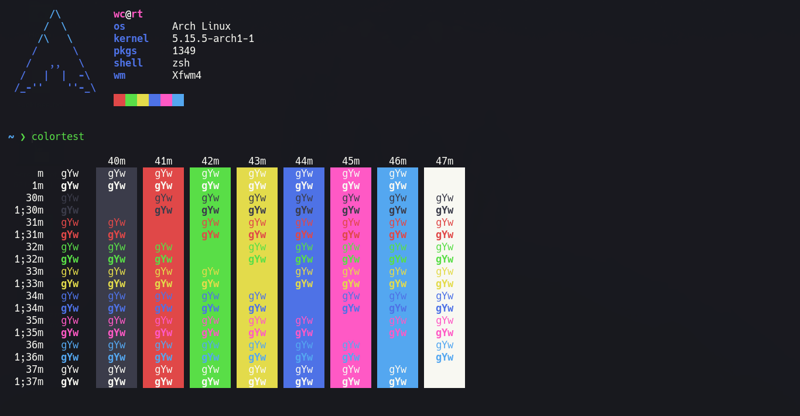

# Vampyric [Alacritty](https://github.com/alacritty/alacritty)

> A dark theme for [Alacritty Terminal](https://github.com/alacritty/alacritty).

## Install

Replace the current color definitions in your `alacritty.yml` configuration file with the content from the [`VampyricDark.yml`](VampyricDark.yml) file.

## Activation

If `live_config_reload` is set to `true` the colors are applied immediately, otherwise Alacritty must be restarted.

## Team

This theme maintained by:

 |
--- |
[WitherCubes](https://github.com/WitherCubes) |

## License

Distributed under MIT License. See `LICENSE` for more information.
